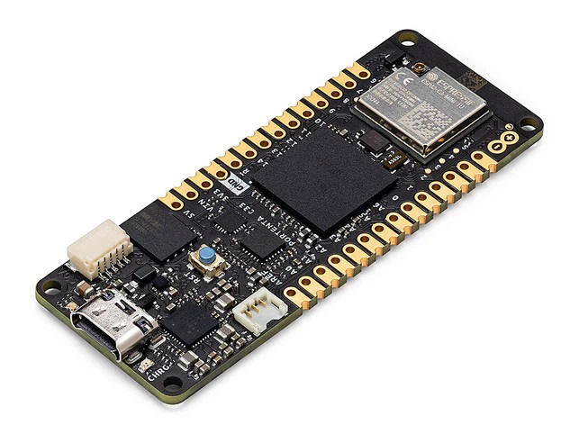

.. _arduino_portenta_c33_board:

Arduino Portenta C33
####################

Overview
********

The Portenta C33 is a System-on-Module (SOM) designed for Internet of Things
(IoT) applications such as Gateways etc. It is based on the Renesas `RA6M5`_
Microcontroller, and shares the same form factor as the Portenta H7 board.

    Portenta C33 (Credit: Arduino)

Hardware
********

The Portenta C33 features the RA6M5 Microcontroller from Reneas. This
Cortex-M33 based device can operate at up to 200MHz and contains 2MB of flash
and 512kB of RAM. The board also contains Wi-Fi and Bluetooth LE connectivity
along with a secure element. For more information about the board see the
`Portenta C33 website`_.

Supported Features
==================

The Zephyr Arduino Portenta C33 configuration supports the following hardware
features:

+-----------+------------+-------------------------------------+
| Interface | Controller | Driver/Component                    |
+===========+============+=====================================+
| NVIC      | on-chip    | nested vector interrupt controller  |
+-----------+------------+-------------------------------------+
| UART      | on-chip    | serial port-polling                 |
+-----------+------------+-------------------------------------+
| PINMUX    | on-chip    | pinmux                              |
+-----------+------------+-------------------------------------+
| GPIO      | on-chip    | GPIO output                         |
|           |            | GPIO input                          |
+-----------+------------+-------------------------------------+

Other hardware features have not been enabled yet for this board.

Programming and debugging
*************************

Building & Flashing
===================

You can build and flash an application in the usual way (See
:ref:`build_an_application` and
:ref:`application_run` for more details).

Here is an example for building and flashing the :zephyr:code-sample:`blinky` application.

.. zephyr-app-commands::
   :zephyr-app: samples/basic/blinky
   :board: arduino_portenta_c33
   :goals: build flash

Debugging
=========

Debugging also can be done in the usual way.
The following command is debugging the :zephyr:code-sample:`blinky` application.
Also, see the instructions specific to the debug server that you use.

.. zephyr-app-commands::
   :zephyr-app: samples/basic/blinky
   :board: arduino_portenta_c33
   :maybe-skip-config:
   :goals: debug

References
**********

.. target-notes::

.. _Portenta C33 website:
	https://www.arduino.cc/pro/hardware-product-portenta-c33/

.. _RA6M5:
   https://www.renesas.com/us/en/document/dst/ra6m5-group-datasheet?r=1493931
