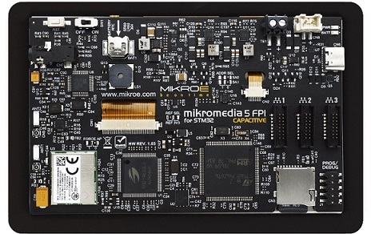

.. _mikromedia_5_stm32f7_cap_fpi:

Mikroe Mikromedia 5 STM32F7 Capacitive FPI
##########################################

Overview
********

The Mikromedia 5 for STM32F7 Capacitive FPI is a board that enables the rapid
development of multimedia and GUI-centric applications.

   Mikromedia 5 STM32F7 Capacitive FPI (Credit: MikroElektronika d.o.o.)

Hardware
********

The Mikromedia 5 board contains a 5" TFT display with capacitive touch screen,
a DSP-powered CODEC IC, USB, WiFi and RF connectivity options, digital motion
sensor, battery charging functionality, piezo-buzzer, SD card reader, RTC, and
much more. At its core, there is a powerful 32-bit STM32F746ZGT6 microcontroller
from ST Microelectronics. For more information about the board see the
`Mikromedia 5 STM32F7 website`_.

Supported Features
==================

The Zephyr Mikromedia 5 STM32F7 configuration supports the following hardware
features:

+-----------+------------+-------------------------------------+
| Interface | Controller | Driver/Component                    |
+===========+============+=====================================+
| NVIC      | on-chip    | nested vector interrupt controller  |
+-----------+------------+-------------------------------------+
| UART      | on-chip    | serial port-polling;                |
|           |            | serial port-interrupt               |
+-----------+------------+-------------------------------------+
| PINMUX    | on-chip    | pinmux                              |
+-----------+------------+-------------------------------------+
| GPIO      | on-chip    | gpio                                |
+-----------+------------+-------------------------------------+
| FLASH     | on-chip    | flash memory                        |
+-----------+------------+-------------------------------------+
| PWM       | on-chip    | pwm                                 |
+-----------+------------+-------------------------------------+
| I2C       | on-chip    | i2c                                 |
+-----------+------------+-------------------------------------+
| USB       | on-chip    | usb                                 |
+-----------+------------+-------------------------------------+
| SDMMC     | on-chip    | disk access                         |
+-----------+------------+-------------------------------------+
| SPI       | on-chip    | spi                                 |
+-----------+------------+-------------------------------------+
| SPI NOR   | on-chip    | off-chip flash                      |
+-----------+------------+-------------------------------------+
| LTDC      | on-chip    | display                             |
+-----------+------------+-------------------------------------+
| SENSOR    | off-chip   | fxos8700                            |
+-----------+------------+-------------------------------------+

Other hardware features are not currently enabled.

Programming and Debugging
*************************

Build and flash applications as usual (see :ref:`build_an_application`
and :ref:`application_run` for more details).

References
**********

.. target-notes::

.. _Mikromedia 5 STM32F7 website:
	https://www.mikroe.com/mikromedia-5-for-stm32f7-capacitive-fpi-with-bezel
