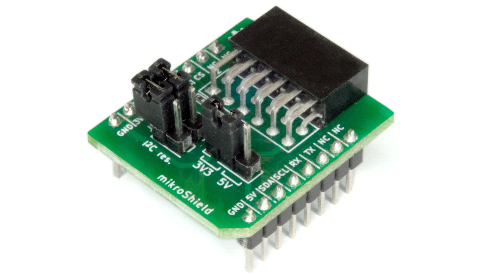

.. _connaxio_pmod_mikroshield:

Connaxio Pmod mikroShield
#########################

Overview
********

The Connaxio Pmod|trade| mikroShield is a simple shield that converts a
`mikroBUS`_ |trade| header to a `Digilent Pmod`_ |trade| socket.

   Connaxio Pmod mikroShield (Credit: Connaxio)

The mikroShield allows the connection of both 6-pin and 12-pin Pmod
compatible modules. The supply voltage can be switched between 3.3V and
5V, and the I2C pull-up resistors can be disconnected if required.

More information about the shield can be found on the
`Connaxio Pmod mikroShield website`_.

Requirements
************

This shield can only be used with a board that provides a mikroBUS |trade|
socket and defines the ``mikrobus_header``, ``mikrobus_serial``,
``mikrobus_i2c`` and ``mikrobus_spi`` node labels (see :ref:`shields` for
more details).

Programming
***********

Include ``--shield connaxio_pmod_mikroshield`` when you invoke ``west build`` with
other mikroBUS shields. For example:

.. zephyr-app-commands::
   :zephyr-app: samples/sensor/accel_polling
   :board: mikroe_stm32_m4_clicker
   :shield: connaxio_pmod_mikroshield,pmod_acl
   :goals: build

References
**********

.. target-notes::

.. _mikroBUS:
   https://www.mikroe.com/mikrobus

.. _Digilent Pmod:
   https://digilent.com/reference/pmod/start

.. _Connaxio Pmod mikroShield website:
   https://www.connaxio.com/pmod_compatible_mikroshield/#pmodtm-compatible-mikroshield
