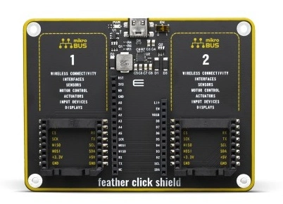

.. _mikroe_feather_click:

Mikroe Feather Click
####################

Overview
********

The Mikroe Feather click is a simple shield that converts an
`Adafruit Feather`_ header to two `mikroBUS`_ |trade| sockets, allowing you to
connect many other click shields to your board. The Mikroe Feather click will
generally be used with other shields that require a mikroBUS |trade| interface.

   MikroElektronika Feather Click Shield (Credit: MikroElektronika)

Two mikroBUS |trade| headers are exposed by the overlay: ``mikrobus_header_1``
and ``mikrobus_header_2``, each corresponding to a socket on the Feather Click
Shield.

The first socket (``mikrobus_header_1``) is the default socket which is
assigned the node label ``mikrobus_header`` in the overlay.

More information about the shield can be found at
`Mikroe Feather Click Shield website`_.

Requirements
************

This shield can only be used with a board which provides a configuration
for a Feather connector.

The board must also define node aliases for Feather serial, SPI and I2C
interfaces (see :ref:`shields` for more details).

Connect shields to the first socket (``mikrobus_header_1``). This socket is
assigned the ``mikrobus_header`` node label.

Programming
***********

Include ``--shield mikroe_feather_click`` when you invoke ``west build`` with
other mikroBUS shields. For example:

.. zephyr-app-commands::
   :zephyr-app: samples/sensor/accel_polling
   :board: sparkfun_thing_plus_ra6m5
   :shield: mikroe_feather_click,mikroe_accel13_click
   :goals: build

References
**********

.. target-notes::

.. _Adafruit Feather:
   https://learn.adafruit.com/adafruit-feather/feather-specification

.. _mikroBUS:
   https://www.mikroe.com/mikrobus

.. _Mikroe Feather Click Shield website:
   https://www.mikroe.com/feather-click-shield
