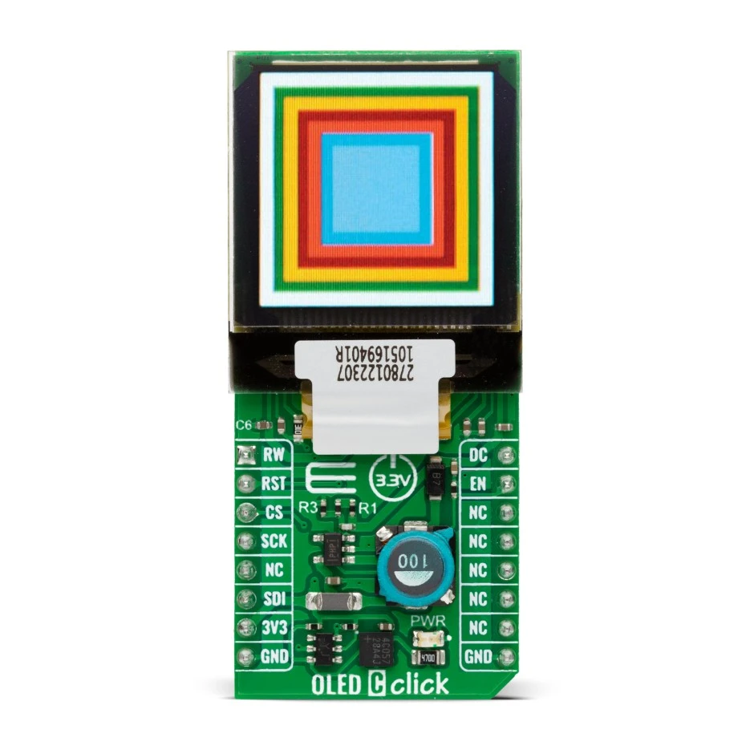

.. _mikroe_oled_c_click_shield:

MikroElektronika OLED C Click Shield
####################################

Overview
********

The MikroElektronika OLED C Click contains a small 96x96 high-color OLED
display in a `mikroBUS`_ |trade| form factor. The display supports up to
65K different colors in a compact 25x25mm size. It features an integrated
controller, the SSD1351, accessible through the SPI serial interface.

   MikroElektronika OLED C Click (Credit: MikroElektronika)

Requirements
************

This shield can only be used with a board that provides a mikroBUS |trade|
socket and defines the ``mikrobus_spi`` and ``mikrobus_header`` node aliases
(see :ref:`shields` for more details).

Programming
***********

Set ``--shield mikroe_oled_c_click`` when you invoke ``west build``. For
example:

.. zephyr-app-commands::
   :zephyr-app: samples/drivers/display
   :board: ek_ra6m4
   :shield: mikroe_oled_c_click
   :goals: build

References
**********

.. target-notes::

.. _OLED C Click
   https://www.mikroe.com/oled-c-click

.. _mikroBUS:
   https://www.mikroe.com/mikrobus
