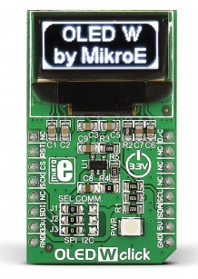

.. _mikroe_oled_w_click:

MikroElektronika OLED W Click
#############################

Overview
********

The MikroElektronika OLED W Click contains a 96x39px light white monochrome
passive matrix OLED display in a `mikroBUS`_ |trade| form factor. The display
is driven by an integrated `SSD1306`_ controller which supports both SPI and
I2C bus protocols.

   MikroElektronika OLED W Click (Credit: MikroElektronika)

Requirements
************

This shield can only be used with a development board that define a node
aliases for the mikroBUS I2C or SPI interfaces (see :ref:`shields` for more
details).

For more information about interfacing to the SSD1306 and the OLED W Click, see
the following documentation:

- `SSD1306 Datasheet`_
- `OLED W Click`_

Programming
***********

Set ``--shield mikroe_oled_w_click`` when you invoke ``west build``. For
example:

.. zephyr-app-commands::
   :zephyr-app: samples/subsys/display/lvgl
   :board: mikroe_stm32_m4_clicker
   :shield: mikroe_oled_w_click
   :goals: build

References
**********

.. target-notes::

.. _SSD1306 Datasheet:
	https://download.mikroe.com/documents/datasheets/SSD1306_datasheet.pdf

.. _OLED W Click:
   https://www.mikroe.com/oled-w-click
