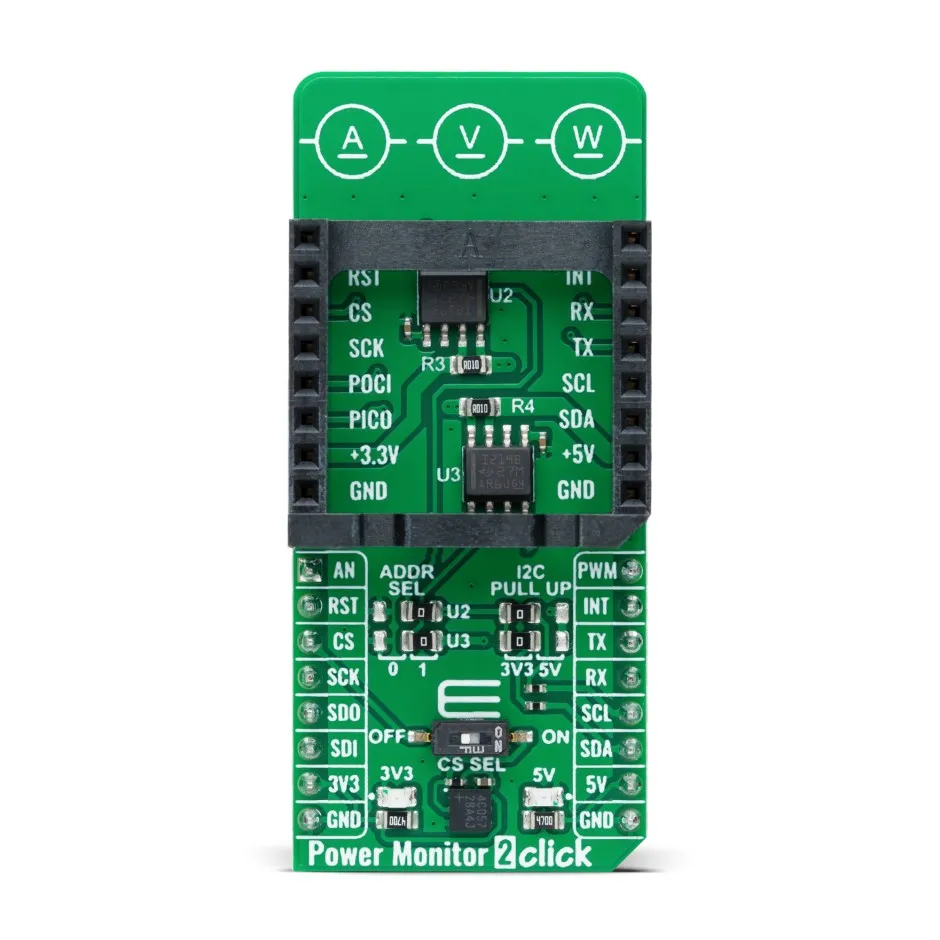

.. _mikroe_power_monitor_2_click:

MikroElektronika Power Monitor 2 Click
######################################

Overview
********

The MikroElektronika `Power Monitor 2 Click`_ feature two `INA219`_ digital
power monitor sensors in a `mikroBUS™`_ form factor. The sensors can
measure voltage and current (using an external shunt resistor).

   MikroElektronika Power Monitor 2 Click (Credit: MikroElektronika)

Requirements
************

This shield can only be used with a board that provides a mikroBUS™
socket and defines a ``mikrobus_i2c`` node label for the mikroBUS™ I2C
interface (see :ref:`shields` for more details).

For more information about the INA219 and the Power Monitor 2 Click, see the
following documentation:

- `Power Monitor 2 Click`_
- `Power Monitor 2 Click Schematic`_
- `INA219`_
- `INA219 Datasheet`_

Programming
***********

Set ``--shield mikroe_power_monitor_2_click`` when you invoke ``west build``.
For example:

.. zephyr-app-commands::
   :zephyr-app: samples/sensor/ina219
   :board: ek_ra6m4
   :shield: mikroe_power_monitor_2_click
   :goals: build

.. _Power Monitor 2 Click:
   https://www.mikroe.com/power-monitor-2-click

.. _Power Monitor 2 Click Schematic:
   https://download.mikroe.com/documents/add-on-boards/click/power-monitor-2-click/power-monitor-2-click-schematic.pdf

.. _INA219:
   https://www.ti.com/product/INA219

.. _INA219 Datasheet:
   https://www.ti.com/lit/gpn/ina219

.. _mikroBUS™:
   https://www.mikroe.com/mikrobus
