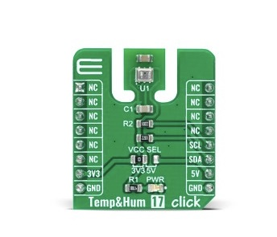

.. _mikroe_temp_hum_17_click_shield:

MikroElektronika TEMP&HUM 17 Click
##################################

The MikroElektronika TEMP&HUM 17 Click carries the `HS3001`_ temperature
and humidity sensor in a `mikroBUS`_ |trade| form factor.

   MikroElektronika TEMP&HUM 17 Click (Credit: MikroElektronika)

Requirements
************

This shield can only be used with a development board that defines a node alias
for the mikroBUS I2C interface (see :ref:`shields` for more details).

For more information about interfacing the HS3001 and the TEMP&HUM 17 Click,
see the following documentation:

- `HS3001 Datasheet`_
- `TEMPHUM 17 Click`_

Programming
***********

Set ``--shield mikroe_temp_hum_17_click`` when you invoke ``west build``. For
example:

.. zephyr-app-commands::
   :zephyr-app: samples/sensors/dht_polling
   :board: clicker_ra4m1
   :shield: mikroe_temp_hum_17_click
   :goals: build

References
**********

.. target-notes::

.. _mikroBUS:
   https://www.mikroe.com/mikrobus

.. _HS3001:
   https://www.renesas.com/us/en/products/sensor-products/environmental-sensors/humidity-temperature-sensors/hs3001-high-performance-relative-humidity-and-temperature-sensor

.. _HS3001 Datasheet:
   https://www.renesas.com/us/en/document/dst/hs3xxx-datasheet?r=417401

.. _TEMPHUM 17 Click:
   https://www.mikroe.com/ble-tiny-click
