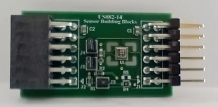

.. _renesas_qciot_hs4001pocz:

Renesas QCIOT HS4001 Pmod
#########################

Overview
********

The `Renesas QCIOT HS4001`_ Pmod |trade| contains a `HS4001`_ digital temperature
and humidity sensor in a `Pmod`_ |trade| form factor.

   Renesas QCIOT HS4001 Pmod (Credit: Renesas Electronics Corporation)

Requirements
************

This shield can only be used with a board that provides a Pmod |trade| socket
and defines the ``pmod_i2c`` node label (see :ref:`shields` for more details).

Programming
***********

Set ``--shield renesas_qciot_hs4001pocz`` when you invoke ``west build``. For
example:

.. zephyr-app-commands::
   :zephyr-app: samples/sensor/dht_polling
   :board: ek-ra8m1
   :shield: renesas_qciot_hs4001pocz
   :goals: build

References
**********

.. target-notes::

.. _Renesas QCIOT HS4001:
   https://www.renesas.com/en/products/sensor-products/environmental-sensors/humidity-temperature-sensors/qciot-hs4001pocz-relative-humidity-sensor-pmod-board

.. _HS4001:
   https://www.renesas.com/en/products/sensor-products/environmental-sensors/humidity-temperature-sensors/hs4001-relative-humidity-and-temperature-sensor-digital-output-15-rh

.. _Pmod:
   https://digilent.com/reference/pmod/start
