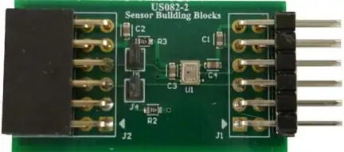

.. _renesas_us082_hs3001evz:

Renesas US082 HS3001EVZ Pmod
############################

Overview
********

The US082 HS3001EVZ contains a Renesas `HS3001`_ digital temperature and
humidity sensor in a `Digilent Pmod`_ |trade| form factor.

   Renesas US082 HS3001EVZ Pmod (Credit: Renesas Electronics)

More information about the Pmod can be found on the
`Renesas US082 HS3001 Pmod website`_.

Requirements
************

This shield can only be used with a board that provides a Pmod |trade|
socket and defines the ``pmod_i2c`` node label (see :ref:`shields` for
more details).

Programming
***********

Set ``--shield renesas_us082_hs3001evz`` when you invoke ``west build``. For
example:

.. zephyr-app-commands::
   :zephyr-app: samples/sensor/dht_polling
   :board: ek-ra8m1
   :shield: renesas_us082_hs3001evz
   :goals: build

References
**********

.. target-notes::

.. _HS3001:
   https://www.renesas.com/en/products/sensor-products/environmental-sensors/humidity-temperature-sensors/hs3001-high-performance-relative-humidity-and-temperature-sensor

.. _Digilent Pmod:
   https://digilent.com/reference/pmod/start

.. _Renesas US082 HS3001 Pmod website:
   https://www.renesas.com/en/products/sensor-products/humidity-sensors/us082-hs3001evz-relative-humidity-sensor-pmod-board-renesas-quick-connect-iot
