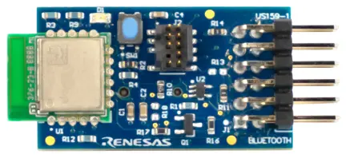

.. _renesas_us159_da14531evz_shield:

Renesas DA14531 Pmod Board
##########################

Overview
********

The Renesas US159 DA14531EVZ carries a `DA14531MOD`_ Bluetooth LE module
in a `Digilent Pmod`_ |trade| form factor.

   Renesas US159 DA14531EVZ Pmod (Credit: Renesas Electronics)

Requirements
************

This shield can only be used with a board that provides a Pmod |trade|
socket and defines the ``pmod_serial`` node label (see :ref:`shields` for
more details).

For more information about interfacing to the DA14531 and the US159 DA14531EVZ
Pmod, see the following documentation:

- `DA14531MOD Datasheet`_
- `US159 DA14531EVZ Pmod`_

Programming
***********

Set ``--shield renesas_us159_da14531evz`` when you invoke ``west build``. For
example:

.. zephyr-app-commands::
   :zephyr-app: samples/bluetooth/beacon
   :board: ek-ra8m1
   :shield: renesas_us159_da14531evz
   :goals: build

References
**********

.. target-notes::

.. _DA14531MOD:
   https://www.renesas.com/us/en/products/wireless-connectivity/bluetooth-low-energy/da14531mod-smartbond-tiny-bluetooth-low-energy-module

.. _DA14531MOD Datasheet:
   https://www.renesas.com/us/en/document/dst/da14531-module-datasheet?r=1601921

.. _US159 DA14531EVZ Pmod:
   https://www.renesas.com/en/products/wireless-connectivity/bluetooth-low-energy/us159-da14531evz-low-power-bluetooth-pmod-board-renesas-quickconnect-iot
