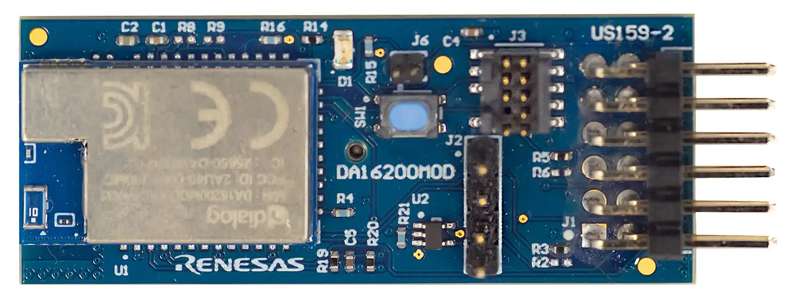

.. _renesas_us159_da16200mevz:

Renesas DA16200 Pmod Shield
#########################

Overview
********

The Renesas US159 DA16200MEVZ features a `DA16200MOD`_ Wi-Fi module in a
`Digilent Pmod`_ |trade| form factor.

   Renesas US159 DA16200MEVZ Pmod (Credit: Renesas Electronics)

Requirements
************

This shield can only be used with a board that provides a Pmod |trade|
socket and defines the ``pmod_serial`` node label (see :ref:`shields` for
more details).

The DA16200 Module contained on the shield must be programmed with a binary
file that supports AT Commands over UART. The `DA16200 DA16600 SDK Update Guide`_
describes how to program a binary file that supports AT commands into the
module.

For more information about interfacing to the DA16200 and the US159
DA16200MEVZ Pmod, see the following documentation:

- `DA16200MOD Datasheet`_
- `US159 DA16200MEVZ Pmod`_

Programming
***********

Set ``--shield renesas_us159_da16200mevz`` when you invoke ``west build``. For
example:

.. zephyr-app-commands::
   :zephyr-app: samples/net/wifi/shell
   :board: ek_ra8m1
   :shield: renesas_us159_da16200mevz
   :goals: build

References
**********

.. target-notes::

.. _DA16200MOD:
   https://www.renesas.com/en/products/da16200mod

.. _Digilent Pmod:
   https://digilent.com/reference/pmod/start

.. _DA16200 DA16600 SDK Update Guide:
   https://www.renesas.com/en/document/apn/da16200da16600-sdk-update-guide

.. _DA16200MOD Datasheet:
   https://www.renesas.com/en/document/dst/da16200mod-datasheet

.. _US159 DA16200MEVZ Pmod:
   https://www.renesas.com/en/design-resources/boards-kits/us159-da16200mevz
