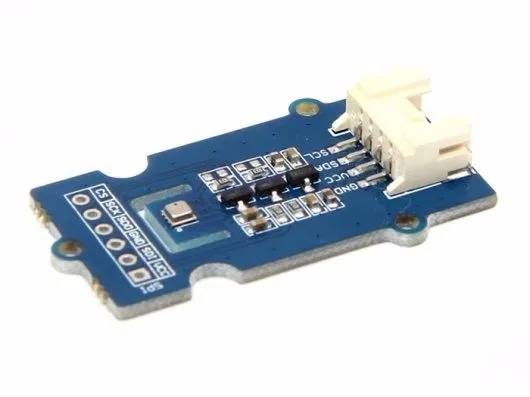

.. _seeed_grove_bme280:

Seeed Grove BME280 Shield
#########################

Overview
********

The Seeed Studio `BME280 Grove`_ features the `BME280`_ integrated
environmental sensor in a Grove form factor. The sensor can measure
relative humidity, barometric pressure, and ambient temperature.

   Seeed BME280 Grove (Credit: Seeed Studio)

Requirements
************

This shield can only be used with a board that provides a Grove socket and
defines a ``grove_i2c`` node label (see :ref:`shields` for more details).

For more information about the BME280 and the Grove Shield, see the following
documentation:

- `BME280 Grove`_
- `BME280`_
- `BME280 Datasheet`_

Programming
***********

Set ``--shield seeed_grove_bme280`` when you invoke ``west build``. For example:

.. zephyr-app-commands::
   :zephyr-app: samples/sensor/bme280
   :board: ek_ra6m4
   :shield: seeed_grove_bme280
   :goals: build

References
**********

.. target-notes::

.. _BME280 Grove:
   https://www.seeedstudio.com/Grove-BME280-Environmental-Sensor-Temperature-Humidity-Barometer.html

.. _BME280:
   https://www.bosch-sensortec.com/products/environmental-sensors/humidity-sensors-bme280/

.. _BME280 Datasheet:
   https://www.bosch-sensortec.com/media/boschsensortec/downloads/datasheets/bst-bme280-ds002.pdf
