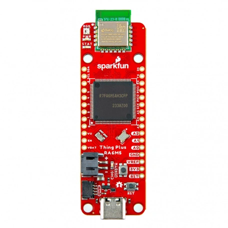

.. zephyr:board:: sparkfun_thing_plus_ra6m5

Overview
********

The Sparkfun Thing Plus RA6M5 is based on the high performance Renesas
`RA6M5`_ Microcontroller. The board uses the `Feather footprint`_ and
contains a Qwiic connector for easy connection of sensors etc.

    Thing Plus RA6M5 (Credit: Sparkfun)

Hardware
********

The Thing Plus RA6M5 features the RA6M5 Microcontroller from Reneas. This
Cortex-M33 based device can operate at up to 200MHz and contains 2MB of flash
and 512kB of RAM. The board also contains a Renesas `DA14531 Module`_ for
Bluetooth LE connectivity along with a battery charger and a fuel gauge.

The DA14531 Module must be programmed with a binary file that supports the
HCI interface over UART with hardware flow control enabled.
The `Renesas SmartBond Flash Programmer`_ tool can be used to download a
suitable binary and then program it into the DA14531 via the SWD interface
pads present on the board. Once the tool has been installed, open it and press
the "Search Online" button. The required binary file can be selected for
download as follows:

.. figure:: da14531-hci-hw-flow-binary.webp
   :align: center
   :alt: DA14531 HCI Binary File Selection

   Selecting the DA14531 HCI Binary File for Download

Press the "Program" button to program the binary file into the DA14531 Module.

For more information about the board see the `Thing Plus RA6M5 website`_.

Supported Features
==================

The ``sparkfun_thing_plus_ra6m5`` board target supports the following hardware
features:

+-----------+------------+-------------------------------------+
| Interface | Controller | Driver/Component                    |
+===========+============+=====================================+
| NVIC      | on-chip    | nested vector interrupt controller  |
+-----------+------------+-------------------------------------+
| UART      | on-chip    | serial port-polling;                |
|           |            | serial port-interrupt               |
+-----------+------------+-------------------------------------+
| I2C       | on-chip    | i2c                                 |
+-----------+------------+-------------------------------------+
| PINMUX    | on-chip    | pinmux                              |
+-----------+------------+-------------------------------------+
| GPIO      | on-chip    | GPIO output                         |
|           |            | GPIO input                          |
+-----------+------------+-------------------------------------+
| RADIO     | on-chip    | bluetooth                           |
+-----------+------------+-------------------------------------+

Other hardware features have not been enabled yet for this board.

The default configuration can be found in the defconfig file:
:zephyr_file:`boards/sparkfun/thing_plus_ra6m5/sparkfun_thing_plus_ra6m5_defconfig`.

Programming and debugging
*************************

Building & Flashing
===================

You can build and flash an application in the usual way (See
:ref:`build_an_application` and
:ref:`application_run` for more details).

Here is an example for building and flashing the :zephyr:code-sample:`blinky` application.

.. zephyr-app-commands::
   :zephyr-app: samples/basic/blinky
   :board: sparkfun_thing_plus_ra6m5
   :goals: build flash

Debugging
=========

Debugging also can be done in the usual way.
The following command is debugging the :zephyr:code-sample:`blinky` application.
Also, see the instructions specific to the debug server that you use.

.. zephyr-app-commands::
   :zephyr-app: samples/basic/blinky
   :board: sparkfun_thing_plus_ra6m5
   :maybe-skip-config:
   :goals: debug

References
**********

.. target-notes::

.. _RA6M5:
	https://www.renesas.com/us/en/document/dst/ra6m5-group-datasheet?r=1493931

.. _Feather footprint:
	https://learn.adafruit.com/adafruit-feather/feather-specification

.. _DA14531 Module:
	https://www.renesas.com/en/products/wireless-connectivity/bluetooth-low-energy/da14531mod-smartbond-tiny-bluetooth-low-energy-module

.. _Renesas SmartBond Flash Programmer:
	https://www.renesas.com/us/en/software-tool/smartbond-flash-programmer

.. _Thing Plus RA6M5 website:
	https://www.sparkfun.com/products/24243
